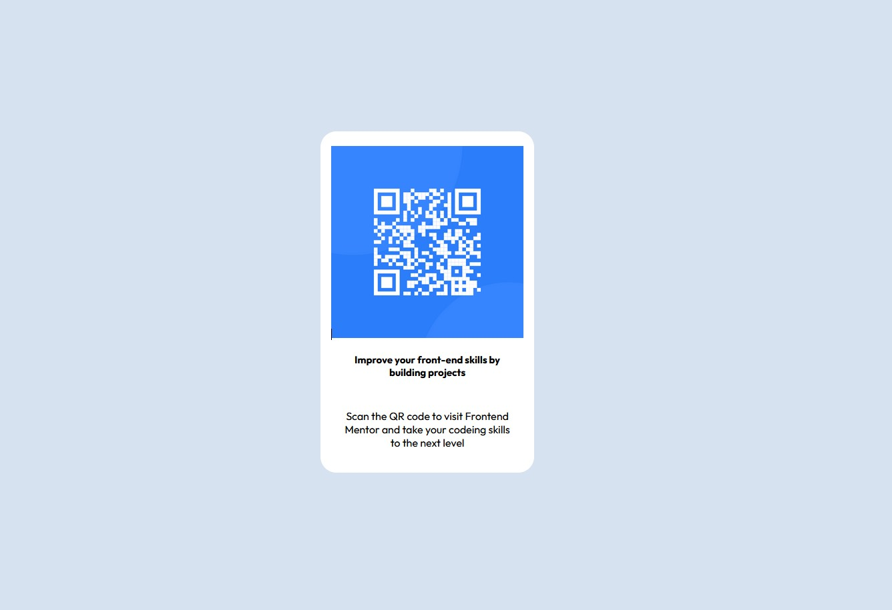

# Frontend Mentor - QR code component solution

This is a solution to the [QR code component challenge on Frontend Mentor](https://www.frontendmentor.io/challenges/qr-code-component-iux_sIO_H).

## contents

- [Overview](#overview)
  - [Screenshot](#screenshot)
- [My process](#my-process)
  - [Built with](#built-with)
  - [Useful resources](#useful-resources)
- [Author](#author)

## Overview

### link
- [Live URL](https://super1115.github.io/QR-code-component-challenge-on-Frontend-Mentor/)
- [Solution URL](https://github.com/Super1115/QR-code-component-challenge-on-Frontend-Mentor)

### Author

- Instagram - [@super_1115_](https://www.instagram.com/super_1115_/)
### Screenshot

### Built with

- HTML5
- CSS3

### Useful resources

- [Google Fonts](https://fonts.google.com/)

